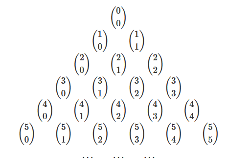

# Maths 🧮

## Kombinatorika - Faktoriál

#### Definice
$$ n! = n * (n-1) * (n-2) ... 3 * 2 * 1 $$
$$ n \in Z^+ $$
$$ 0! = 1 $$

#### Úpravy
$$ {11! \over 9!} = {11\*10\*9! \over 9!} = 11 * 10 = 110 $$

#### Příklady
Vypočítej $4!$:

$$ 4! = 4 * 3 * 2 * 1 $$

### Uprav + podm.:

$$ {(n+3)! \over (n+1)!} $$

#### Řešení

$$ n \ge -1  ; n \in Z $$

$$ {(n+3)! \over (n+1)!} = {(n+1)! * (n+2) * (n+3) \over (n+1)!} = (n+2)(n+3) = n^2 + 5n + 6 $$

### Uprav + podm.:

$$ {1 \over n!} - {1 \over (n+1)!} $$

#### Řešení

$$ n \ge 0 ; n \in Z $$

$$ {1 \over n!} - {1 \over (n+1)!} = {n+1-1 \over n!(n+1)} = {n \over (n+1)!} = {1 \over (n-1)(n+1)} = {1 \over n^2 - 1} $$

### Uprav + podm.:

$$ {(n-2)! \over (n-4)!} $$

#### Řešení

$$ n \ge 2 ; n \in Z $$

$$ {(n-2)! \over (n-4)!} =  {(n-2)(n-3)(n-4)! \over (n-4)!} = (n-2)(n-3) = n^2 -5n + 6 $$

### Odstraň faktoriály + podm.:

$$ {(n-6)! \over (n-5)!} - {(n+7)! \over (n+5)!} $$

#### Řešení

$$ n \ge 6 ; n \in Z  $$

$$ {(n-6)! \over (n-5)!} - {(n+7)! \over (n+5)!} = {(n-6)! \over (n-5)(n-6)!} - {(n+7)(n+6)(n+5)! \over (n+5)!} = {1 \over (n-5)} - {(n+7)(n+6)}$$

### Uprav + podm.:
$$ {n! \over (n-3)!} + {(n+1)! \over (n-2)!} + {(n+2)! \over (n-1)!} - (n^2 + 4) $$

#### Řešení

$$ n \ge 3 ; n \in Z $$

$$ {n! \over (n-3)!} + {(n+1)! \over (n-2)!} + {(n+2)! \over (n-1)!} - (n^2 + 4) = n(n-1)(n-2) + n(n+1)(n-1) + n(n+2)(n+1) - n^2 -4 = 3n^3 - n^2 + 3n - 4 $$

## Kombinatorika - Rovnice s faktoriály

### Příklady

#### Vyřeš rovnici

Podmínka:

$$ n \ge 5;n \in Z $$

Řešení rovnice:

$$ {(n+6)! \over (n+4)!} - n * {(n-4)! \over (n-5)!} = 5n + 80 $$

$$ (n+6)(n+5) - n(n-4) = 5n + 80 $$

$$ n^2 + 11n + 30 - n^2 + 4n = 5n + 80 $$

$$ 15n + 30 = 5n + 80 $$

$$ 10n = 50 $$

$$ n = 5 $$

Vyřeš rovnici:

$$ (n+2)! * n! = 24(n+1)!(n-1)! $$

$$ {(n+2)! * n! \over (n+1)! (n-1)!} = 24 $$

$$ n^2 +2n = 24 $$

$$ n^2 + 2n - 24 = 0 $$

Řešení kvadratické rovnice:

$$ D = b^2 - 4ac = 4 + 96 = 100 $$

$$ n_1,n_2 = { -2 \pm \sqrt{4+96} \over 2} = {-2 \pm 10 \over 2} $$

$$ n_1 = -6 $$
$$ n_2 = 4 $$

Podmínka rovnice:

$$ n \ge 1;n \in Z $$

Řešení rovnice:

$$ K = \lbrace 4 \rbrace  $$

## Kombinatorika - Kombinační číslo

$$ {\binom{n}{k}} = {n! \over k!(n-k)!}$$

"n nad k"

$$ {n,k \in N_0};{n \ge k} $$

$$ {\binom{n}{n}} = 1 $$

$$ {\binom{n}{0}} = 1 $$

$$ {\binom{n}{n-1}} = n $$

$$ {\binom{n}{1}} = n $$

$$ {\binom{n}{n-k}} = {n! \over (n-k)!(k)!} = {\binom{n}{k}} $$

### Rovnice s kombinačními čísly

Podm. + řešte:

Podmínka:

$$ x \ge 2 ; x \in N_0 $$

Řešení:

$$ \binom{10}{1} \binom{x}{x-2} - \binom{x+3}{x+1} = 15 \binom{x}{0} $$

$$ 10 * \binom{x}{2} - \binom{x+3}{x+1} = 15 $$

$$ {10 * x! \over 2!(x-2)!} - {(x+3)! \over (x+1)!2!} = 15 $$

$$ {10 * x * (x-1) \over 2} - {(x+3)(x+2) \over 2} = 15  $$

$$ 10x^2 - 10x - x^2 - 5x - 6 = 15 $$

$$ 9x^2 - 15x - 6 = 30  $$

$$ 9x^2 - 15x - 36 = 0 $$

$$ 3x^2 - 5x - 12 = 0 $$

Řešení kvadratické rovnice:

$$ 3x^2 - 5x - 12 = 0 $$

$$ D = 25 + 4 * 3 * 12 = 169 $$

$$ n_1,n_2 = { 5 \pm \sqrt{169} \over 6} = { 5 \pm 13 \over 6}  $$

$$ n_1 = -{4 \over 3} $$

$$ n_2 = 3 $$

$$ K = \lbrace 3 \rbrace $$ 

Podm. + řešte:

$$ \binom{x}{1} = 2x - 3 - \binom{x-3}{x-4} $$

Podmínky: 

$$ x \ge 4 ; x \in Z $$

$$ x = 2x - 3 - \binom{x-3}{x - 4} $$

$$ x = 2x - 3 - {(x-3)! \over (x-4)!} $$

$$ x = 2x -3 - (x-3) $$

$$ x -3 -x + 3 = 0 $$

$$ 0 = 0 $$

$$ K = \lbrace 4 ; 5 ; 6 ; ... \rbrace $$

Podm. + řešte: 

$$ 2\binom{x+6}{x+4} - \binom{x+4}{x+2} = 4! + \binom{5}{2}x $$

Podmínky:

$$ x \ge -2 ; x \in Z $$

Řešení:

$$ 2 * {(x+6)! \over (x+4)!2!} - {(x+4)! \over (x+2)!2!} = 24 + {5! \over 2!3!}x $$

$$ 2(x+6)(x+5) - (x+4)(x+3) = 48 + 20x $$

$$ 2x^2 + 22x + 60 - x^2 -7x - 12 - 48 - 20x = 0 $$

$$ x^2 - 5x = 0 $$

$$ x_1 = 0 $$
$$ x_2 = 5 $$

$$ K = \lbrace 0;5 \rbrace $$

## Kombinatorika - Pascalův trojúhelník

### Binomická věta

$$ n \in N $$

$$ (a+b)^n = \binom{n}{0}a^nb^0 + \binom{n}{1}a^{n-1}b^1 + \dots \binom{n}{n-1}a^1b^{n-1} + \binom{n}{n}a^0b^n $$

#### Příklady

Příklad 1

$$ (x^3 - {2 \over x^2})^5 = (x^3)^5(-{2 \over x^2})^0 + 5(x^3)^4(-{2 \over x^2})^1 + 10(x^3)^3(-{2 \over x^2})^2 + 10(x^3)^2(-{2 \over x^2})^3 + 5(x^3)^1(-{2 \over x^2})^4 + (x^3)^0(-{2 \over x^2})^5 = x^{15} - 10x^{10} + 40x^5 - 80 + 80x^{-5} - 32x^{-10} $$

Příklad 2

$(-{1 \over x^2} - 2x^3)^{16}$... patnáctý člen

$$ \binom{16}{14} (-{1 \over x^2})^2 (-2x^3)^{14}  =  1 966 080 x ^ {38} $$

## Kombinatorika - Slovní úlohy

### Kombinatorické pravidlo součtu a součinu

Podmínka A **nebo** B => $A+B$

Podmínka A **i** B => $A*B$

## Pravděpodobnost
- nezávislého jevu A

$$ P(A) = {a \over m} $$

$ a \dots $ počet všech možností považovaných za správné

$ m \dots $ počet všech možností

$$ P(A \cap B) = P(A) * P(B) $$

$$ P(A \cup B) = P(A) + P(B) $$