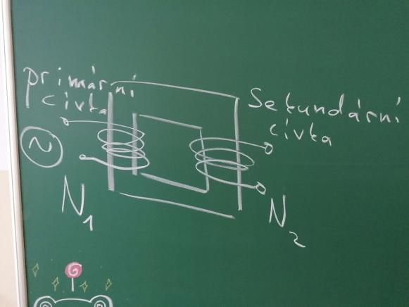

# Physics 🍎

## Indukované napětí a proud

### Využití
- Bezdrátové nabíječky, čipy

### Pokus
Máme dvě cívky. Pokud v první prochází střídavý proud vytváří se proměnné magnetické pole, na které reaguje druhá cívka vznikem indukovaného napětí a tíme ve druhé začne protékat el. proud.

### Transformátor

### Příklady

#### Příklad 1

Urychlovač částic má obvod 27 km. Cívky mají $B = 8T$. Až na jakou rychlost se můžou urychlit ty protony?

Hmotnost protonu je $m_p = 1,67 * 10^{-27}$

Poloměr:

$$ o = 2 \pi r $$

$$ {27 000 \over 2 \pi} = r $$

$$ r = 4300 $$

Poloměr je $r = 4300$ m

$Q$ - el. náboj

$$ Q = Ne $$

$e = 1,602 * 10^{-19}$ - elementární náboj

$$ F_m = F_{od} $$

$$ Bev = m_p{v^2 \over r} $$

$$ 8*1,602 * 10^{-19} * v = 1,67 * 10^{-27} * {v^2 \over 4300}  $$

$$ v = {8 * 1,602 * 10^{-19} * 4300 \over 1,67 * 10^{-27}} $$

$$ v = 3,3 * 10^{12} $$

Rychlost je $v = 3,3 * 10^{12}$  $ms^{-1}$, ale fyzikálně je špatně, jelikož nebere ohled na relativitu

#### Příklad 2

Transformátor snižuje napětí z $6000V$  na $220V$, výkon je $P = 150 kW$, zjistěte proudy na primární a sekundární cívce a transformační poměr.

$$ P = UI $$

$$ {I_1 \over I_2} = {U_2 \over U_1} = {N_2 \over N_1} $$

$$ I_1 = {150 000 \over 6000} = 25A $$

$$ I_2 = {150 000 \over 220} = 681A $$

$$ {I_1 \over I_2} = {25 \over 681} = 0,04 $$

#### Příklad 3
Máme dva rovnoběžné vodiče ve vzdálenosti 20 cm od sebe, působí na sebe silou 16 N na každém metru, určete velikost el. proudu ve vedení.

$$ k = {4\pi * 10^{-7} \over 2\pi} = 2 * 10^{-7} $$

$$ F_m = k {I^2 \over d}l $$

$$ 16 = 2*10^{-7}{I^2 \over 0,2} * 1 $$

$$ I = \sqrt{0,2 * 16 \over 2*10^-7} = 4000A $$

